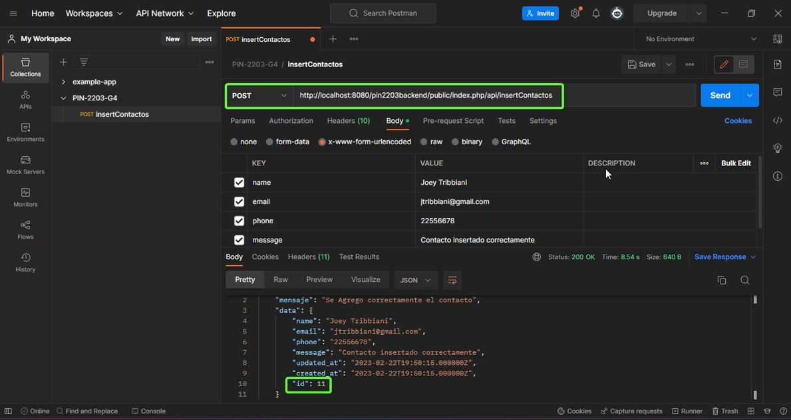
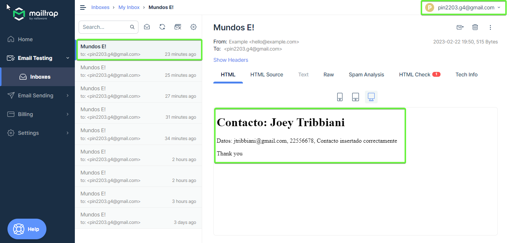
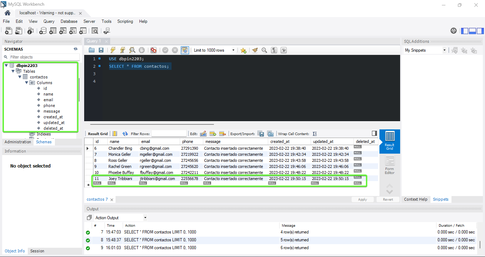

## PIN 2203 - Grupo 4 - PET ADOPCIONES SPA - BACKEND

Para poner en evidencia lo aprendido durante el dictado se presenta el desarrollo backend de una aplicación web, en Laravel 9. Corresponde a una sección de formulario con validación clara del lado del servidor.

El proyecto  contempló la creación de una API REST en Laravel 9 con las funcionalidades de: envío de formulario vía mail y almacenamiento de los datos del envío en una base de datos (MySQL).

El presente desarrollo se expondrá vía web con su correspondiente frontend responsive en ReactJS.

## Alcance del Proyecto:

-   Creación de servicio API REST. Fue probada con el software 'Postman Inc'.

-   Envío del formulario vía email. Se utilizó la plataforma 'Mailtrap by railsware'. 

-   Almacenamiento de los datos en la base de datos: 'dbpin2203'. 

## Ejecución Local del Proyecto:

-   [Clonar](https://docs.github.com/es/repositories/creating-and-managing-repositories/cloning-a-repository) el repositorio pin2203backend en una nueva carpeta dentro de su carpeta htdocs local. Ejemplo: C:\xampp\htdocs\pin2203backend.  
-   Cambiar desde la terminal a la carpeta creada: cd C:\xampp\htdocs\pin2203backend
-   Ejecutar 'composer install' para instalar las dependencias. 
-   Crear el archivo .env que debe ser hermano (y su contenido debe ser igual al) del archivo .env.example. 
-   Abrir phpmyadmin o la consola de MySQL y crear la nueva base de datos: 'dbpin2203'. 
-   Crear el archivo .env que debe ser hermano (y su contenido debe ser igual al) del archivo .env.example. 
-   En la terminal ejecutar 'php artisan migrate --seed'. Ese comando va a migrar la base de datos (crear tabla) y alimentarla.
-   En la misma terminal es deseable generar una clave para nuestro proyecto con 'php artisan key:generate'.
-   Ejecutar php artisan 'storage:link' para crear algunos enlaces con el almacenamiento y la carpeta pública.
-   En la url http://localhost/pin2203backend/public/ debe desplegarse la app.

Nota importante: si aparece un error se recomienda ejecutar 'composer update', actualizar la versión de PHP, revisar la conexión de internet, etcétera.

## Licencia

El entorno de trabajo Laravel 9 es un proyecto de código  abierto bajo licencia: [MIT license](https://opensource.org/licenses/MIT).

## Documentación de Laravel

Laravel tiene la más  extensa y exhaustiva documentación:  [documentation](https://laravel.com/docs).
